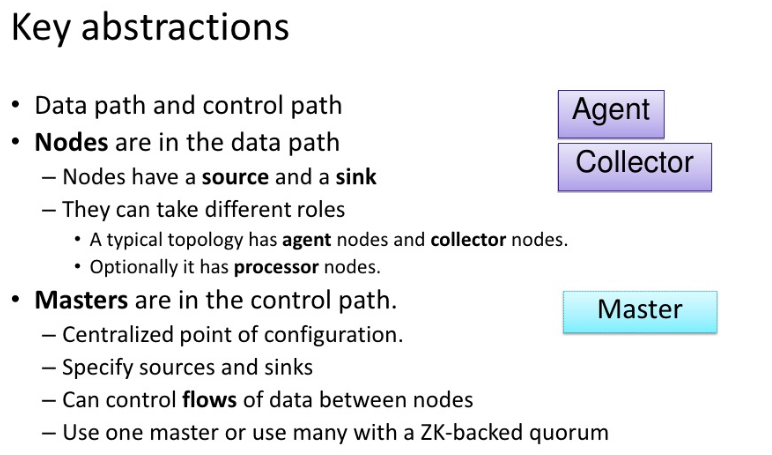
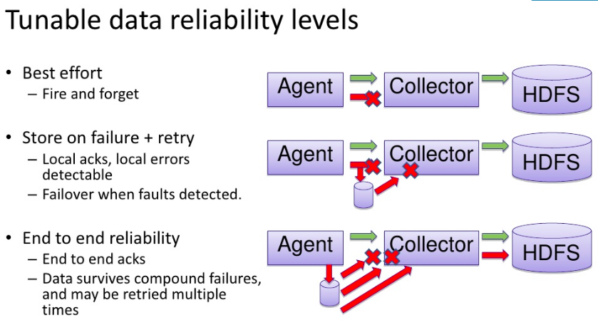
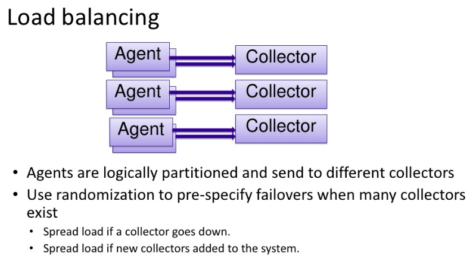
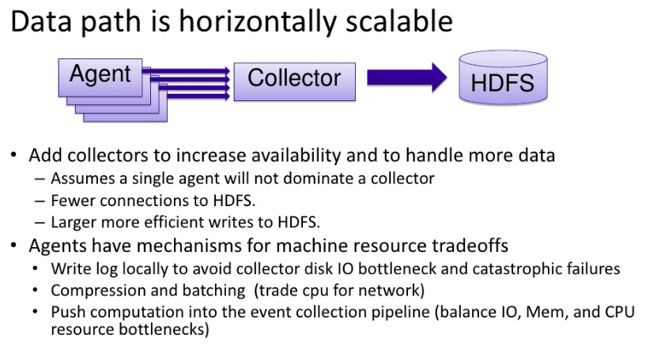
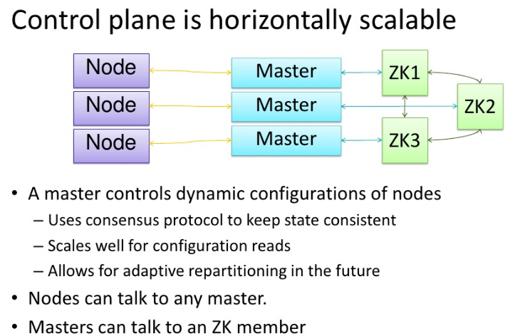

## Flume

Designed for high-volume ingestion into Hadoop of event-based data

A Flume installation = collection of connected agents running in a distributed topology. 

**To use Flume**:
 - run a Flume agent (a long-lived Java process that runs sources and sinks, connected by channels).
 - agents on the edge of the system collect and forward data to agents responsible for aggregating and then storing the data in its final destination
 - source produces events and delivers them to the channel
 - channel stores the events until they are forwarded to the sink. 
 
_Source-channel-sink_ combination as a basic Flume building block




### Features
- distributed
- scalable
- reliable
- manageable
- integrated with Hadoop ecosystem
- extensible
- agent - installed on each node, collects events, runs in JVM, Consist of Source, channel, sink
- interceptor - Filters useful events, decorates events by adding metadata
- encrypt - encrypt events in a file on disk
- agents hierarchy
- Compression supported
- Events can be multiplixied to multiple agents 
- Events can be replicated 
- events can be delevered in failover mode
- events can be load-balanced
- events can be stored on in memory or disk
- many destinations are supported
- suitable for large volume data collection, esp when data is being produced in multiple locations
- once planned and sized appropriately, will practically run itself without any operational intervention
- provides weak ordering guarantee
- tx exchange ensures the data is never lost in transit between agents, nor at point of ingest or terminal destinations
  

#### Flume properties file: 
- configuration through the java properties files;
- property name form a hierarchy with the agent name at the top level;
- properties for each component defined at the next level of the hierarchy;
- agent autoreloads if property is changed

### Sources

Source              | Description
--------------------|------------
Avro                | Listens on a port for events sent over Avro RPC by an Avro sink or the Flume SDK.
Exec                | Runs a Unix command and converts lines read from standard output into events. This source cannot guarantee delivery of events to the channel; the spooling directory source or the Flume SDK are better alternatives.
HTTP                | Listens on a port and converts HTTP requests into events using a pluggable handler (e.g., a JSON handler or binary blob handler).
JMS                 | Reads messages from a JMS queue or topic and converts them into events.
Netcat              | Listens on a port and converts each line of text into an event.
Sequence generator  | Generates events from an incrementing counter. Useful for testing.
Spooling directory  | Reads lines from files placed in a spooling directory and converts them into events, 
Syslog              | Reads lines from syslog and converts them into events.
Thrift              | Listens on a port for events sent over Thrift RPC by a Thrift sink or the Flume SDK.
Twitter             | Connects to Twitter’s streaming API (1% of the firehose) and converts tweets into events.

### Sink

Sink                | Description
--------------------|---------------------------------------
Avro                | Sends events over Avro RPC to an Avro source.
Elasticsearch       | Writes events to an Elasticsearch cluster using the Logstash format.
File roll           | Writes events to the local filesystem.
HBase               | Writes events to HBase using a choice of serializer.
HDFS                | Writes events to HDFS in text, sequence file, Avro, or a custom format.
IRC                 | Sends events to an IRC channel.
Logger              | Logs events at INFO level using SLF4J. Useful for testing.
Morphline (Solr)    | Runs events through an in-process chain of Morphline commands. Typically used to load data into Solr.
Null                | Discards all events.
Thrift              | Sends events over Thrift RPC to a Thrift source.

### Channel 
Channel             | Description
--------------------|---------------------------------------
File                | Stores events in a transaction log stored on the local filesystem, flushes to the disk in the end of transaction, supports encryption.
JDBC                | Stores events in a database (embedded Derby).
Memory              | Stores events in an in-memory queue.

### Interceptor
Interceptor         | Description
--------------------|---------------------------------------
Host                | Sets a host header containing the agent’s hostname or IP address on all events.
Morphline           | Filters events through a Morphline configuration file. Useful for conditionally dropping events or adding headers based on pattern matching or content extraction.
Regex extractor     | Sets headers extracted from the event body as text using a specified regular expression.
Regex filtering     | Includes or excludes events by matching the event body as text against a specified regular expression.
Static              | Sets a fixed header and value on all events.
Timestamp           | Sets a timestamp header containing the time in milliseconds at which the agent processes the event.
UUID                | Sets an id header containing a universally unique identifier on all events. Useful for later deduplication.

### Transactions 
- uses separate transactions to guarantee delivery from the source to the channel and from the channel to the sink
- every event produced by the source will reach the sink.
- every event will reach the sink at least once — that is, duplicates are possible.
- with at-least-once semantics duplicate events can be removed further down the processing pipeline. Usually this takes the form
  of an application-specific deduplication job written in MapReduce or Hive.
- source uses transactions to write to the channel
- sink uses tx to remove data from channel
- sink tx commits only after successful transfer of data

  
### Recovery

  If agent1 doesn’t recover, then the loss is limited to the events in its file channel 
  that had not been delivered to next agent before agent1 shut down.
  Other nodes in the tier can take over the function of the failed node.
  If the nodes are running load-balanced web servers, then other nodes will absorb the failed web server’s traffic, 
  and they will generate new Flume events that are delivered to agent2. Thus, no new events are lost.

  An unrecoverable agent2 failure is more serious:
   - any events in the channels of upstream first-tier agents will be lost, 
   - all new events generated by these agents will not be delivered either. 
   The solution to this problem is for agent1 to have multiple redundant Avro sinks, arranged in a sink group, 
   so that if the destination agent2 Avro endpoint is unavailable, it can try another sink from the group. 
   
   
### Sink Group
Allows multiple sinks to be treated as one, for failover or load-balancing purposes
If a second-tier agent is unavailable, then events will be delivered to another second-tier agent and on to HDFS without disruption.

To configure a sink group:
- the agent’s sinkgroups property is set to define the sink group’s name; 
- the sink group lists the sinks in the group, and also the type of the sink processor (sets the policy for choosing a sink).
```properties
agent1.sinkgroups = sinkgroup1
agent1.sinkgroups.sinkgroup1.sinks = sink1a sink1b
agent1.sinkgroups.sinkgroup1.processor.type = load_balance
agent1.sinkgroups.sinkgroup1.processor.backoff = true
```


### Processors
1) Load_balance attempts to distribute the event flow over both sinks in the group, 
using a round-robin selection mechanism (processor.selector property)
By default, sink unavailability is not remembered by the sink processor, so failing sinks are retried for every batch of events being delivered. 
This can be inefficient, processor.backoff property changes the behavior so that failing sinks are blacklisted for an exponentially increasing timeout period 
(up to a maximum period of 30 seconds, controlled by processor.selector.maxTimeOut)
2) Failover uses a preferred sink if it is available, and fails over to another sink in the case that the preferred sink is down. 
The failover sink processor maintains a priority order for sinks in the group, and attempts delivery in order of priority. 
If the sink with the highest priority is unavailable the one with the next highest priority is tried, and so on. 
Failed sinks are blacklisted for an increasing timeout period (up to a maximum period of 30 seconds, processor.maxpenalty).


### Delivery Guarantees
Separate transaction to deliver each batch of events from the spooling directory source to each channel. 
Channel can be designated as an optional channel, so that if the transaction associated with it fails, 
this will not cause events to be left in the source and tried again later.
If the agent fails before both channel transactions have committed, 
    then the affected events will be redelivered after the agent restarts — 
    this is true even if the uncommitted channels are marked as optional
```properties
agent1.sources.source1.selector.optional = channel1b
```

Channels (necessarily have a limited capacity, if fills up any new events will be lost, can be drained by diff sinks to diff destinations or pipelines)
Channels: 
- buffers data and insulates downstream from load spikes
- provides persistent store for data in case the process restarts
- provides flow ordering and tx guarantees

file channel:
    - has the property of being durable: once an event has been written to the channel, it will not be lost, even if the agent restarts.
    - will not recover more than one million events (can be overridden by its capacity property)
    - will stop accepting events if the free disk space for its checkpoint directory falls below 500 MB (minimumRequiredSpace property).
Memory channel -  events are stored in memory, events are lost if the agent restart


#### Command example 
```shell script
flume-ng agent \
--conf-file flume_setup.properties \
--name agent \
--conf $FLUME_HOME/conf \
-Dflume.root.logger=INFO,console
```

Sink to Hadoop example:
``` properties
agent1.sources = source1
agent1.sinks = sink1
agent1.channels = channel1
agent1.sources.source1.channels = channel1
agent1.sinks.sink1.channel = channel1
agent1.sources.source1.type = spooldir
agent1.sources.source1.spoolDir = /tmp/spooldir
agent1.sinks.sink1.type = hdfs
agent1.sinks.sink1.hdfs.path = /tmp/flume
agent1.sinks.sink1.hdfs.filePrefix = events
agent1.sinks.sink1.hdfs.fileSuffix = .log
agent1.sinks.sink1.hdfs.inUsePrefix = _
agent1.sinks.sink1.hdfs.fileType = DataStream
agent1.channels.channel1.type = file
```

### Writing to HDFS:
File is kept open by the HDFS sink until:
- it has either been open for a given time (default 30 seconds, controlled by the hdfs.rollInterval property)
- has reached a given size (default 1,024 bytes, set by hdfs.rollSize ),
- has had a given number of events written to it (default 10, set by hdfs.rollCount ).
If any of these criteria are met, the file is closed and its in-use prefix and suffix are removed.

property        | Default   | description
----------------|-----------|--------------
rollInterval    | 30        | Number of seconds before rolling a file
rollSize        |1024       | File size, to trigger roll of a file (0 deactivates)
rollCount       |10         | Number of events written to file before rolling of a file
idleTimeout     | 0         | Timeout after which inactive files get closed
batchSize       | 100       | number of events written to file before they flushed to HDFS

### Partitioning and interceptors
For Flume event data, it’s very common to partition by time. 
A process can be run periodically that transforms completed partitions (to remove duplicate events).

To store data in partitions by setting hdfs.path to include subdirectories that use time format escape sequences:
```properties
agent1.sinks.sink1.hdfs.path = /tmp/flume/year=%Y/month=%m/day=%d
```
The partition that a Flume event is written to is determined by the timestamp header on the event.
Events don’t have this header by default, but it can be added using a Flume interceptor. 

Interceptors:
- components that can modify or drop events in the flow; 
- attached to sources, 
- run on events before the events have been placed in a channel.
```properties
agent1.sources.source1.interceptors = interceptor1
agent1.sources.source1.interceptors.interceptor1.type = timestamp
```
when there are multiple tiers of Flume agents there can be a significant difference between creation time and write time, 
especially in the event of agent downtime.
For these cases, the HDFS sink has a setting, **hdfs.useLocalTimeStamp** , that will use a timestamp generated by the Flume agent running the HDFS sink.


### File formats
- A good idea to use a binary format for storing your data in, since the resulting files are smaller than they would be if you used text.
- controlled using hdfs.fileType
- defaults to SequenceFile (write events to a sequence file with LongWritable keys that contain the event timestamp and BytesWritable values that contain the event body.)
- for Avro:
    - hdfs.fileType=DataStream, 
    - serializer (lack of an hdfs.prefix) must be set to avro_event, 
    - serializer.compressionCodec property for compression
    - event is represented as an Avro record with two fields: 
        1) headers - an Avro map with string values
        2) body - an Avro bytes field

### Sink in Avro example
```properties
agent1.sinks.sink1.type = hdfs
agent1.sinks.sink1.hdfs.path = /tmp/flume
agent1.sinks.sink1.hdfs.filePrefix = events
agent1.sinks.sink1.hdfs.fileSuffix = .avro
agent1.sinks.sink1.hdfs.fileType = DataStream
agent1.sinks.sink1.serializer = avro_event
agent1.sinks.sink1.serializer.compressionCodec = snappy
```


### Fan Out
Delivering events from one source to multiple channels, so they reach multiple sinks
Source is configured to deliver to multiple channels by setting agent.sources.source1.channels to a space-separated list of channel names
```properties
agent1.sinks = sink1a sink1b
agent1.channels = channel1a channel1b
```
Indexing events for search is a good example of where fan out is used in practice.
The MorphlineSolrSink extracts fields from Flume events and transforms them into a Solr document (using a Morphline configuration file),
which is then loaded into a live Solr search server. 
The process is called near real time since ingested data appears in search results in a matter of seconds.

In normal fan-out flow, events are replicated to all channels.
For more selective behavior:
- set a **multiplexing** selector on the source,
- defining routing rules that map particular event header values to channels

### Agent Tiers
If there is one agent running on every node producing raw data, 
then with the setup described so far, at any particular time each file being written to HDFS will consist entirely of the events from one node.

Aggregating Flume events is achieved by having tiers of Flume agents:
1 tier: collects events from the original sources (such as web servers)
        sends them to a smaller set of agents in the second tier,
2 tier: aggregate events from the first tier before writing them to HDFS
Further tiers: may be warranted for very large numbers of source nodes.
               
Proc of aggregating the events from a group of nodes in a single file:
- result in fewer, larger files (with the concomitant reduction in pressure on HDFS, and more efficient processing in MapReduce)
- files can be rolled more often since they are being fed by a larger number of nodes
- leading to a reduction between the time when an event is created and when it’s available for analysis.

Tiers: 
- constructed by using a special sink that sends events over the network, and a
  corresponding source that receives events
  
Since there are two file channels running on the same machine, they are configured to point to different data and checkpoint directories 
(they are in the user’s home directory by default). This way, they don’t try to write their files on top of one another.

Each agent is run independently, using the same --conf-file parameter but different agent --name parameters

### Topology advices
One Aggregating agent can be used with anywhere from 4 to 16 client agents
    
    - must handle projected ingest volume
    - resulting number of tiers should provide for routing, load-balancing and failover requirements

Exit batch size is same as total exit data volume divided by number of Agents in a tier
    
    - having some extra room is good
    - keep contextual rooting in mind
    - consider duplication impact when batch sizes are large 

Channel capacity equals to worst case data ingest rate sustained over the worst case downstream outage interval
    
    - multiple disks will yield better performance
    - channel size impacts the back-pressure buildup in the pipeline
    



### Agent failures
- Make event durable at the generation point
    - if log generator goes down, it's not generating logs
    - if event generation point fails and recovers, data will reach the end point
    - allows for synchronous writes in log generating apps
- Watchdog program to restart agent if it fails

### Collector failures
- Data is durable at the agent
    - minimize the amount of state and possible data loss
    - not necessary to durably keep intermediate state at collector
    - retry if collector goes down
- use hot failover so agents can use alternate paths
    - master predetermines failovers to load balance when collectors go down

### Master service failures
- master should not be single point of failure
- master keep two kinds of information
    - configuration: 
        - keept in ZooKeeper ensemble for persistenst, highly available metadata store
        - failures easily recovered from
    - ephemeral (heartbeat, acks, metrics)
        - kept in memory
        - failures will lose data
        - this data can be easily replicated 








### Not a good fit if:
- very large objects
- infrequent bulks loads