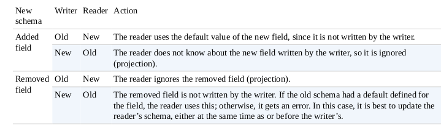

## Avro

Language-neutral data serialization system.

Features: 
1. Avro data is described using a language-independent schema
2. Avro assumes that the schema is always present — at both read and write time — 
which makes for a very compact encoding, since encoded values do not need to be tagged with a field identifier
3. Avro schemas are usually written in JSON, and data is usually encoded using a binary format
4. Data is always serialized with its schema
5. Official support: Java, Python, C, C++, C#, Ruby
6. RPC protocol
7. Apache 2.0
8. Untagged data - less type information need to encoded with data, resulting in small serialization size
9. No manually-assigned field IDs - schemas differencies resolved  symbolically, using field names 
10. Supports data evolution
11. Leverages dynamic typing
12. Avro system defines a container file used to house a schema and its data
 

**.avsc** is the conventional extension for an Avro schema

#### JSON Avro schema example:
```json
{
"type": "record",
"name": "StringPair",
"doc": "A pair of strings.",
"fields": [
{"name": "left", "type": "string", "default": "some_value"},
{"name": "right", "type": "string"}
]
}
```


The fact that there is only one binary format is significant,  because it means:
- the barrier for implementing a new language binding is lower 
- avoids the problem of a combinatorial explosion of languages and formats, which would harm interoperability.

Avro has rich schema resolution capabilities.

Within certain carefully defined constraints,the schema used to read data need not be identical to the schema that was used to write the data. 
This is the mechanism by which Avro supports schema evolution.

Avro specifies an object container format for sequences of objects,

An Avro datafile has a metadata section where the schema is stored, which makes the file self-describing.

Avro datafiles support compression and are splittable,

### Avro types: 

#### Primitive


#### Complex


Records, enums and fixed types have fullnames that contain 2 parts:
- namespace (ex. com.example)
- name (e.g. Order)

Namespaces are dot separated sequences and case sensitive

Elements referenced by undotted name alone inherit the most closely enclosing namespace
Fullnames must be unique and defined before use 


**Mappings:**
1. Generic mapping (All languages support a dynamic mapping, which can be used even when the schema is not known ahead of runtime.)
2. Specific mapping (the Java and C++ implementations can generate code to represent the data for an Avro schema. Code generation, which is called the Specific mapping in Java, is an optimization that is useful when you have a copy of the schema before you read or write data. Generated classes also provide a more domain-oriented API for user code than Generic ones.)
3. Reflect mapping (in Java, maps Avro types onto preexisting Java types using reflection, It is slower but can be a convenient way of defining a type, since Avro can infer a schema automatically.)


Avro string can be represented by either Java String or the Avro Utf8 Java type. 
The reason to use Utf8 is efficiency: because it is mutable, a single Utf8 instance may be reused for reading or writing a series of values. 
Also, Java String decodes UTF-8 at object construction time, whereas Avro Utf8 does it lazily, which can increase performance in some cases.

Utf8 is the default for Generic and Specific, but it’s possible to use String for a particular mapping. 

There are a couple of ways to achieve this. 
1)  Set the avro.java.string property in the schema to String :
```json
{ "type": "string", "avro.java.string": "String" }
```
2) For the Specific mapping, you can generate classes that have String-based getters and setters. When using the Avro Maven plug-in, this is done by setting the configuration property stringType to String (The Specific API has a demonstration of this).


#### Avro datafiles (Containers): 

have a .avro extension

Files consist of 
- header (metadata and a sync marker)
- one or more data blocks with data defined in schema

Metadata:
- header meta data can be any data useful to the file's author
- avro assigns 2 metadata values:
    - avro.schema - schema in JSON format
    - avro.codec - defining the name of the compression codec used on the block if any
        - mandatory codecs are null and deflate
        - Snappy is anothe common codec
Data blocks:
- contain a long count of objects in the block, a long size a bytes, the serialized objects and the 16 byte sync mark
- the block prefix and sync mark allow data to be efficiently skipped during HDFS mapred splits and other similar processing
- corrupt blocks can be detected


### Avro Schema resolution rules 

 
Another useful technique for evolving Avro schemas is the use of name aliases. 
Aliases allow you to use different names in the schema used to read the Avro data than in the schema originally used to write the data.
```json
{
  "type": "record",
  "name": "StringPair",
  "doc": "A pair of strings with aliased field names.",
  "fields": [
    {"name": "first", "type": "string", "aliases": ["left"]},
    {"name": "second", "type": "string", "aliases": ["right"]}
  ]
}
```


### Sort order

For most Avro types, the order is the natural one — for example, numeric types are ordered by ascending numeric value.

Enums are compared by the order in which the symbols are defined and not by the values of the symbol strings

Avro implements efficient binary comparisons- Avro does not have to deserialize binary data into objects to perform the comparison, 
because it can instead work directly on the byte streams

All types except record have preordained rules for their sort order, that cannot be overridden by the user.
For records one can control the sort order by specifying the order attribute for a field, using one of three values: 
- ascending (the default), 
- descending (to reverse the order)
- ignore (so the field is skipped for comparison purposes).

```json
{
"type": "record",
"name": "StringPair",
"doc": "A pair of strings, sorted by right field descending.",
"fields": [
{"name": "left", "type": "string", "order": "ignore"},
{"name": "right", "type": "string", "order": "descending"}
]
}
```

### Code examples

##### Read schema
```java
Schema.Parser parser = new Schema.Parser();
Schema schema = parser.parse(
getClass().getResourceAsStream("StringPair.avsc"));
```

##### Create instance of Avro record using Generic API
```java
GenericRecord datum = new GenericData.Record(schema);
datum.put("left", "L");
datum.put("right", "R");
```

####  Serialize record to an output stream
```java
ByteArrayOutputStream out = new ByteArrayOutputStream();
DatumWriter<GenericRecord> writer = new GenericDatumWriter<GenericRecord>(schema);
Encoder encoder = EncoderFactory.get().binaryEncoder(out, null);
writer.write(datum, encoder);
encoder.flush();
out.close();
```

DatumWriter - translates data objects into the types understood by an Encoder
Encoder - writes to the output stream


#### Read object back from byte buffer
```java
DatumReader<GenericRecord> reader = new GenericDatumReader<GenericRecord>(schema);
Decoder decoder = DecoderFactory.get().binaryDecoder(out.toByteArray(), null);
GenericRecord result = reader.read(null, decoder);
assertThat(result.get("left").toString(), is("L"));
assertThat(result.get("right").toString(), is("R"));
```
#### Writing using Specific API 
```java
StringPair datum = new StringPair();
datum.setLeft("L");
datum.setRight("R");
ByteArrayOutputStream out = new ByteArrayOutputStream();
DatumWriter<StringPair> writer = new SpecificDatumWriter<StringPair>(StringPair.class);
Encoder encoder = EncoderFactory.get().binaryEncoder(out, null);
writer.write(datum, encoder);
encoder.flush();
out.close();
```

#### Reading using Specific API
```java
DatumReader<StringPair> reader = new SpecificDatumReader<StringPair>(StringPair.class);
Decoder decoder = DecoderFactory.get().binaryDecoder(out.toByteArray(), null);
StringPair result = reader.read(null, decoder);assertThat(result.getLeft(), is("L"));
assertThat(result.getRight(), is("R"));
```

#### Avro maven plugin 
File can be ganerated using Avro' Maven plugin for compiling schemas

```xml
<plugin>
    <groupId>org.apache.avro</groupId>
    <artifactId>avro-maven-plugin</artifactId>
    <version>${avro.version}</version>
    <executions>
        <execution>
            <id>schemas</id>
            <phase>generate-sources</phase>
            <goals>
                <goal>schema</goal>
            </goals>
            <configuration>
                <includes>
                    <include>StringPair.avsc</include>
                </includes>
                <stringType>String</stringType>
                <sourceDirectory>src/main/resources</sourceDirectory>
                <outputDirectory>${project.build.directory}/generated-sources/java
                </outputDirectory>
            </configuration>
        </execution>
    </executions>
</plugin>
```