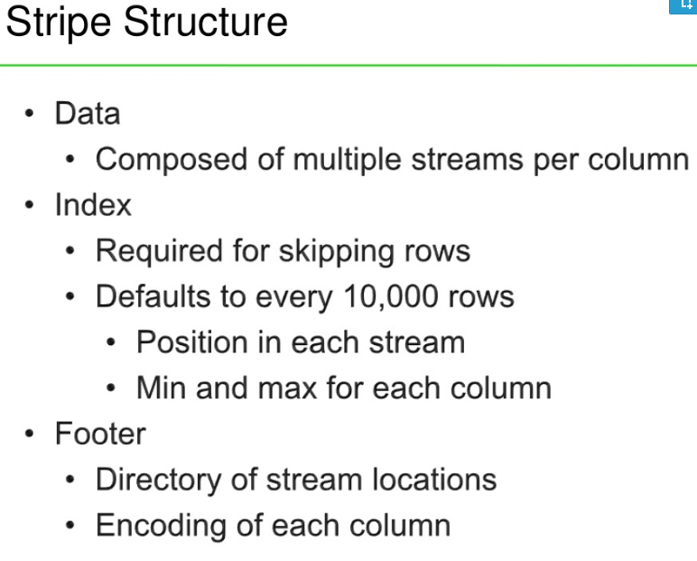

## ORCFile

ORCFile (Optimized Record Columnar File)

Free and open-source self-describing type-aware column-oriented data storage format

Part of the Hive project

### There have been 2 released ORC file versions:
- ORC v0 was released in Hive 0.11.
- ORC v1 was released in Hive 0.12 and ORC 1.x.

Features: 
- optimized for large streaming reads, but with integrated support for finding required rows quickly
- because ORC files are type-aware, the writer chooses the most appropriate encoding for the type and builds an internal index as the file is written.
- storing data in a columnar format lets the reader read, decompress, and process only the values that are required for the current query
- supports the complete set of types in Hive, including the complex types: structs, lists, maps, and unions
- can apply generic compression using zlib, or Snappy on top of the lightweight compression for even smaller files
- supports projection, which selects subsets of the columns for reading, so that queries reading only one column read only the required bytes
- include light weight indexes that include the minimum and maximum values for each column in each set of 10,000 rows and the entire file
- vectorized readers (Java, C++)
- Hive ACID Tx
- Single SerDe format
- Protobuf metadata storage

Uses type specific readers and writers that provide light weight compression techniques (resulting in dramatically smaller files): 
- dictionary encoding, 
- bit packing, 
- delta encoding 
- run length encoding 

ORC files are divided into stripes that are roughly 64MB by default. 
The stripes in a file are independent of each other and form the natural unit of distributed work. 
Within each stripe, the columns are separated from each other so the reader can read just the columns that are required.

### File Tail

Since HDFS does not support changing the data in a file after it is written, ORC stores the top level index at the end of the file

The file’s tail consists of 3 parts: 
- the file metadata, 
- file footer
- postscript.

Metadata for ORC is stored using Protocol Buffers, which provides the ability to add new fields without breaking readers

The sections of the file tail are (and their protobuf message type):
- encrypted stripe statistics: list of ColumnarStripeStatistics
- stripe statistics: Metadata
- footer: Footer
- postscript: PostScript
- psLen: byte

###  Postscript
The Postscript section provides the necessary information to interpret the rest of the file including:
- the length of the file’s Footer and Metadata sections, 
- the version of the file (the lowest version of Hive that is guaranteed to be able to read the file and it stored as a sequence of the major and minor version)
- the kind of general compression used 

Postscript is never compressed and ends one byte before the end of the file

The process of reading an ORC file works backwards through the file:
1) Rather than making multiple short reads, the ORC reader reads the last 16k bytes of the file with the hope that it will contain both the Footer and Postscript sections. 
2) The final byte of the file contains the serialized length of the Postscript, which must be less than 256 bytes. 
3) Once the Postscript is parsed, the compressed serialized length of the Footer is known and it can be decompressed and parsed.

### Footer

Contains:
- the layout of the body of the file
- the type schema information
- the number of rows
- the statistics about each of the columns

file is broken in to three parts:
- Header (consists of the bytes “ORC’’ to support tools that want to scan the front of the file to determine the type of the file)
- Body (contains the rows and indexes)
- Tail (gives the file level information)

### Stripe Information

The body of the file is divided into stripes
Each stripe is self contained and may be read using only its own bytes combined with the file’s Footer and Postscript
Each stripe contains only entire rows so that rows never straddle stripe boundaries

Stripes have three sections: 
- a set of indexes for the rows within the stripe,
- the data itself,
- a stripe footer

Both the indexes and the data sections are divided by columns so that only the data for the required columns needs to be read

### Type Information

All of the rows in an ORC file must have the same schema. 
Logically the schema is expressed as a tree, where the compound types have subcolumns under them.

### Column Statistics

For each column, the writer records the count and depending on the type other useful fields. For most of the primitive types, it records the minimum and maximum values; and for numeric types it additionally stores the sum: 
- For integer, decimals and floating point types (tinyint, smallint, int, bigint), the column statistics includes the minimum, maximum, and sum. If the sum overflows long at any point during the calculation, no sum is recorded.
- For strings, the minimum value, maximum value, and the sum of the lengths of the values are recorded.
- For booleans, the statistics include the count of false and true values
- Date columns record the minimum and maximum values as the number of days since the UNIX epoch (1/1/1970 in UTC).
- Timestamp columns record the minimum and maximum values as the number of milliseconds since the UNIX epoch (1/1/1970 00:00:00)
- Binary columns store the aggregate number of bytes across all of the values

The column statistics will also record if there are any null values within the row group by setting the hasNull flag. The hasNull flag is used by ORC’s predicate pushdown to better answer ‘IS NULL’ queries

### User Metadata

The user can add arbitrary key/value pairs to an ORC file as it is written. The contents of the keys and values are completely application defined, but the key is a string and the value is binary

Care should be taken by applications to make sure that their keys are unique and in general should be prefixed with an organization code.

### File Metadata
File Metadata section contains column statistics at the stripe level granularity. 

These statistics enable input split elimination based on the predicate push-down evaluated per a stripe

### Compression

If the ORC file writer selects a generic compression codec (zlib or snappy), every part of the ORC file except for the Postscript is compressed with that codec

One of the requirements for ORC is that the reader be able to skip over compressed bytes without decompressing the entire stream. To manage this, ORC writes compressed streams in chunks with headers as in the figure below. To handle uncompressable data, if the compressed data is larger than the original, the original is stored and the isOriginal flag is set. Each header is 3 bytes long with (compressedLength * 2 + isOriginal) stored as a little endian value. 

Each compression chunk is compressed independently so that as long as a decompressor starts at the top of a header, it can start decompressing without the previous bytes.

The default compression chunk size is 256K, but writers can choose their own value. Larger chunks lead to better compression, but require more memory. The chunk size is recorded in the Postscript so that readers can allocate appropriately sized buffers. Readers are guaranteed that no chunk will expand to more than the compression chunk size.

ORC files without generic compression write each stream directly with no headers

### Stripes

The body of ORC files consists of a series of stripes. 
Stripes are large (typically ~200MB) and independent of each other and are often processed by different tasks. 
The defining characteristic for columnar storage formats is that the data for each column is stored separately and that reading data out of the file should be proportional to the number of columns read

In ORC files, each column is stored in several streams that are stored next to each other in the file. 

For example, an integer column is represented as two streams PRESENT, which uses one with a bit per value recording if the value is non-null, and DATA, which records the non-null values. 
If all of a column’s values in a stripe are non-null, the PRESENT stream is omitted from the stripe. 

For binary data, ORC uses three streams PRESENT, DATA, and LENGTH, which stores the length of each value. 
The details of each type will be presented in the following subsections.

The layout of each stripe looks like:
- index streams
    - unencrypted
    - encryption variant 1..N
- data streams
    - unencrypted
    - encryption variant 1..N
- stripe footer

### Stripe Footer

Contains the encoding of each column and the directory of the streams including their location.

To describe each stream, ORC stores:
- the kind of stream, 
- the column id,
- the stream’s size in bytes. 

The details of what is stored in each stream depends on the type and encoding of the column

### Indexes

#### Row Group Index
The row group indexes consist of a ROW_INDEX stream for each primitive column that has an entry for each row group. 
Row groups are controlled by the writer and default to 10,000 rows. 
Each RowIndexEntry gives the position of each stream for the column and the statistics for that row group.

The index streams are placed at the front of the stripe, because in the default case of streaming they do not need to be read. 
They are only loaded when either predicate push down is being used or the reader seeks to a particular row.

To record positions, each stream needs a sequence of numbers. 
For uncompressed streams, the position is the byte offset of the RLE run’s start location followed by the number of values that need to be consumed from the run. 
In compressed streams, the first number is the start of the compression chunk in the stream, followed by the number of decompressed bytes that need to be consumed, and finally the number of values consumed in the RLE.

For columns with multiple streams, the sequences of positions in each stream are concatenated. 
That was an unfortunate decision on my part that we should fix at some point, because it makes code that uses the indexes error-prone.

Because dictionaries are accessed randomly, there is not a position to record for the dictionary and the entire dictionary must be read even if only part of a stripe is being read.

#### Bloom Filter Index

added to ORC indexes from Hive 1.2.0 onwards

Predicate pushdown can make use of bloom filters to better prune the row groups that do not satisfy the filter condition.
The bloom filter indexes consist of a BLOOM_FILTER stream for each column specified through ‘orc.bloom.filter.columns’ table properties. 
A BLOOM_FILTER stream records a bloom filter entry for each row group (default to 10,000 rows) in a column. 
Only the row groups that satisfy min/max row index evaluation will be evaluated against the bloom filter index

Each bloom filter entry stores the number of hash functions (‘k’) used and the bitset backing the bloom filter

Bloom filter internally uses two different hash functions to map a key to a position in the bit set

Bloom filter streams are interlaced with row group indexes. This placement makes it convenient to read the bloom filter stream and row index stream together in single read operation.

### Managing memory

### Schema evolution

