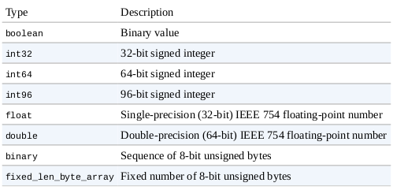
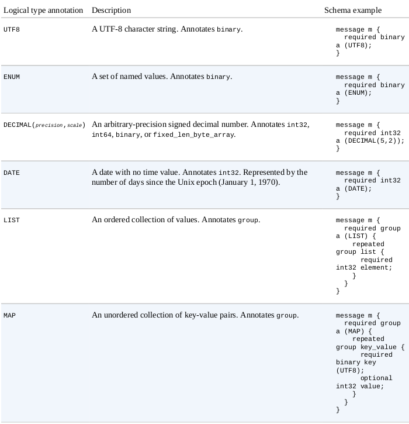
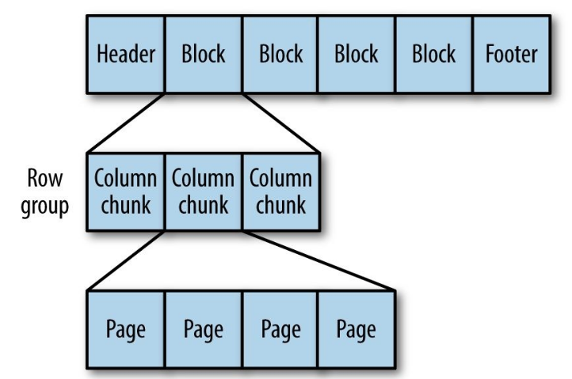
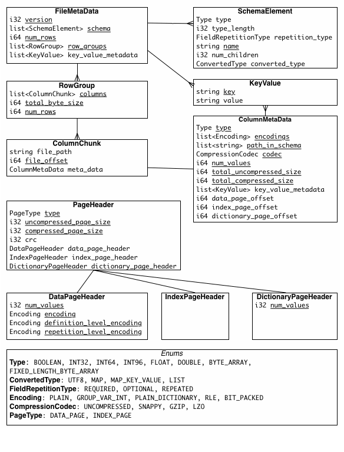
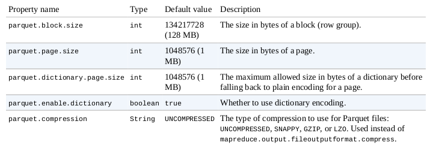

## Parquet

Binary, columnar storage format that can efficiently store nested data.

Columnar formats: 
- enable greater efficiency, in terms of both file size and query performance. 
- File sizes are usually smaller than row-oriented equivalents since in a columnar format the values from one column are stored next to each other, which usually allows a very efficient encoding (A column storing a timestamp, for example, can be encoded by storing the first value and the differences between subsequent values (which tend to be small due to temporal locality: records from around the same time are stored next to each other). 
- Query performance is improved too since a query engine can skip over columns that are not needed to answer a query. 
 
 Features: 
- ability to store data that has a deeply nested structure in true columnar fashion (important since schemas with several levels of nesting are common in real-world systems).
- uses a novel technique for storing nested structures in a flat columnar format with little overhead, which was introduced by Google engineers in the Dremel paper. The result is that even nested fields can be read independently of other fields, resulting in significant performance improvements.
- large number of tools that support it as a format.
- flexibility also extends to the in-memory representation: the Java implementation is not tied to a single representation, so one can use in-memory data models for Avro, Thrift, or Protocol Buffers to read your data from and write it to Parquet files.
- integrated with Spark SQL and DataFrames
- Predicate pushdowm
- IO to a minimum by reading from a disk only the data required for the query
- schema evolution to some extent: adding new columns at the end
- language independent

#### _Glossary_
- Block (hdfs block): This means a block in hdfs and the meaning is unchanged for describing this file format. The file format is designed to work well on top of hdfs.
- File: A hdfs file that must include the metadata for the file. It does not need to actually contain the data.
- Row group: A logical horizontal partitioning of the data into rows. There is no physical structure that is guaranteed for a row group. A row group consists of a column chunk for each column in the dataset.
- Column chunk: A chunk of the data for a particular column. These live in a particular row group and is guaranteed to be contiguous in the file.
- Page: Column chunks are divided up into pages. A page is conceptually an indivisible unit (in terms of compression and encoding). There can be multiple page types which is interleaved in a column chunk.


Hierarchically, a file consists of one or more row groups. A row group contains exactly one column chunk per column. Column chunks contain one or more pages.


### Primitive types



The data stored in a Parquet file is described by a schema.

Schema has at its root a message containing a group of fields.
Each field has:
- a repetition (required, optional, or repeated), 
- a type,
- a name. 


Parquet schema example for a weather record:
```java
message WeatherRecord {
    required int32 year;
    required int32 temperature;
    required binary stationId (UTF8);
}
```

No primitive string type. Strings are represented as binary primitives with a UTF8 annotation.
Instead, Parquet defines logical types that specify how primitive types should be interpreted, so there is a separation between the serialized representation (the primitive type) and the semantics that are specific to the application (the logical type). 

### Types: 

The types supported by the file format are intended to be as minimal as possible, with a focus on how the types effect on disk storage. For example, 16-bit ints are not explicitly supported in the storage format since they are covered by 32-bit ints with an efficient encoding. This reduces the complexity of implementing readers and writers for the format.

### Logical types


Complex types in Parquet are created using the group type, which adds a layer of nesting.
A group with no annotation is simply a nested record.

Lists and maps are built from groups with a particular two-level group structure,
A list is represented as a LIST group with a nested repeating group (called list) that contains an element field.


### Nested encoding 
In a column-oriented store, a column’s values are stored together.

Parquet uses the encoding from Dremel, where every primitive type field in the schema is stored in a separate column, and for each value written, the structure is encoded by means of two integers: the definition level and the repetition level.

The upshot of this encoding is that any column (even nested ones) can be read independently of the others. 
In the case of a Parquet map, for example, the keys can be read without accessing any of the values, which can result in significant performance improvements, especially if the values are large


### File format
A Parquet file consists of a header followed by one or more blocks, terminated by a footer.
The header contains only a 4-byte magic number, PAR1 , that identifies the file as being in Parquet format

```properties
4-byte magic number "PAR1"
<Column 1 Chunk 1 + Column Metadata>
<Column 2 Chunk 1 + Column Metadata>
...
<Column N Chunk 1 + Column Metadata>
<Column 1 Chunk 2 + Column Metadata>
<Column 2 Chunk 2 + Column Metadata>
...
<Column N Chunk 2 + Column Metadata>
...
<Column 1 Chunk M + Column Metadata>
<Column 2 Chunk M + Column Metadata>
...
<Column N Chunk M + Column Metadata>
File Metadata
4-byte length in bytes of file metadata
4-byte magic number "PAR1"
```

In the above example, there are N columns in this table, split into M row groups. 
The file metadata contains the locations of all the column metadata start locations. 


All the file metadata is stored in the footer to allow for single pass writing. 

The footer’s metadata includes:
- the format version, 
- the schema, 
- any extra key-value pairs, 
- and metadata for every block in the file. 

The final two fields in the footer are:
- a 4-byte field encoding the length of the footer metadata, 
- and the magic number again (PAR1).

Consequence of storing the metadata in the footer is that reading a Parquet file requires:
- an initial seek to the end of the file (minus 8 bytes) to read the footer metadata length,
- then a second seek backward by that length to read the footer metadata.

Parquet files don’t need sync markers since the block boundaries are stored in the footer metadata.
Therefore, Parquet files are splittable, since the blocks can be located after reading the footer and can then be processed in parallel

Each block in a Parquet file stores a row group, which is made up of column chunks containing the column data for those rows. 
The data for each column chunk is written in pages.

Readers are expected to first read the file metadata to find all the column chunks they are interested in. 
The columns chunks should then be read sequentially.




There are three types of metadata: 
- file metadata
- column (chunk) metadata
- page header metadata

All thrift structures are serialized using the TCompactProtocol




Each page contains values from the same column, making a page a very good candidate for compression since the values are likely to be similar.

The first level of compression is achieved through how the values are encoded. 
The simplest encoding is plain encoding, where values are written in full (e.g., an int32 is written using a 4-byte little-endian representation), but this doesn’t afford any compression in itself.


Parquet also uses more compact encodings, including:
- delta encoding (the difference between values is stored), 
- run-length encoding (sequences of identical values are encoded as a single value and the count), 
- dictionary encoding (a dictionary of values is built and itself encoded, then values are encoded as integers representing the indexes in the dictionary). 

In most cases, it also applies techniques such as bit packing to save space by storing several small values in a single byte.

Parquet will choose an appropriate encoding automatically, based on the column type.

In addition to the encoding, a second level of compression can be applied using a standard compression algorithm on the encoded page bytes. 
By default, no compression is applied, but Snappy, gzip, and LZO compressors are all supported.

For nested data, each page will also store the definition and repetition levels for all the values in the page. 
Since levels are small integers (the maximum is determined by the amount of nesting specified in the schema), 
they can be very efficiently encoded using a bit-packed run-length encoding.

Definition and repetition levels allow to store blank values and encode data efficiently, schema information into the metadata.

Definition levels specify how many optional fields in the path for the column are defined.
 
Repetition levels specify at what repeated field in the path has the value repeated

The max definition and repetition levels can be computed from the schema (i.e. how much nesting there is). 
This defines the maximum number of bits required to store the levels (levels are defined for all values in the column).

Two encodings for the levels are supported BITPACKED and RLE. Only RLE is now used as it supersedes BITPACKED.


### Nulls 
Nullity is encoded in the definition levels (which is run-length encoded). 
NULL values are not encoded in the data. 
For example, in a non-nested schema, a column with 1000 NULLs would be encoded with run-length encoding (0, 1000 times) for the definition levels and nothing else.


### Data Pages
For data pages, the 3 pieces of information are encoded back to back, after the page header: 
- definition levels data,
- repetition levels data,
- encoded values. 

The size of specified in the header is for all 3 pieces combined.
The data for the data page is always required. 
The definition and repetition levels are optional, based on the schema definition. 
If the column is not nested (i.e. the path to the column has length 1), we do not encode the repetition levels (it would always have the value 1). 
For data that is required, the definition levels are skipped (if encoded, it will always have the value of the max definition level).

For example, in the case where the column is non-nested and required, the data in the page is only the encoded values.


### Column chunks
Column chunks are composed of pages written back to back. 
The pages share a common header and readers can skip over page they are not interested in. 
The data for the page follows the header and can be compressed and/or encoded.
The compression and encoding is specified in the page metadata.


### Parquet configuration
Parquet file properties are set at write time.


Setting the block size is a trade-off between scanning efficiency and memory usage.
Larger blocks are more efficient to scan through since they contain more rows, which
improves sequential I/O (as there’s less overhead in setting up each column chunk).
However, each block is buffered in memory for both reading and writing, which limits
how large blocks can be. The default block size is 128 MB.

The Parquet file block size should be no larger than the HDFS block size for the file so
that each Parquet block can be read from a single HDFS block (and therefore from a
single datanode).

A page is the smallest unit of storage in a Parquet file, so retrieving an arbitrary row (with
a single column, for the sake of illustration) requires that the page containing the row be
decompressed and decoded. Thus, for single-row lookups, it is more efficient to have
smaller pages, so there are fewer values to read through before reaching the target value.
However, smaller pages incur a higher storage and processing overhead, due to the extra
metadata (offsets, dictionaries) resulting from more pages. The default page size is 1 MB.


#### Unit of parallelization
- MapReduce - File/Row Group
- IO - Column chunk
- Encoding/Compression - Page


Most of the time Parquet files are processed using higher-level tools like Pig, Hive, or Impala, but sometimes low-level sequential access may be required.

Parquet has a pluggable in-memory data model to facilitate integration of the Parquet file format with a wide range of tools and components.
ReadSupport and WriteSupport are the integration points in Java, and implementations of these classes do the conversion between the objects used by the tool or component and the objects used to represent each Parquet type in the schema

Parquet schema definition:
```java
MessageType schema = MessageTypeParser.parseMessageType(
    "message Pair {\n" +
    " required binary left (UTF8);\n" +
    " required binary right (UTF8);\n" +
    "}");
```

Create an instance of a Parquet message for each record to be written to the file
```java
GroupFactory groupFactory = new SimpleGroupFactory(schema);
Group group = groupFactory.newGroup()
.append("left", "L")
.append("right", "R");
```

Create a Parquet file and write a message to it.
```java
Configuration conf = new Configuration();
Path path = new Path("data.parquet");
GroupWriteSupport writeSupport = new GroupWriteSupport();
GroupWriteSupport.setSchema(schema, conf);
ParquetWriter<Group> writer = new ParquetWriter<Group>(path, writeSupport,
    ParquetWriter.DEFAULT_COMPRESSION_CODEC_NAME,
    ParquetWriter.DEFAULT_BLOCK_SIZE,
    ParquetWriter.DEFAULT_PAGE_SIZE,
    ParquetWriter.DEFAULT_PAGE_SIZE, /* dictionary page size */
    ParquetWriter.DEFAULT_IS_DICTIONARY_ENABLED,
    ParquetWriter.DEFAULT_IS_VALIDATING_ENABLED,
    ParquetProperties.WriterVersion.PARQUET_1_0, conf);
writer.write(group);
writer.close();
```

Reading a Parquet file
```java
GroupReadSupport readSupport = new GroupReadSupport();
ParquetReader<Group> reader = new ParquetReader<Group>(path, readSupport);
```
ParquetReader has a read() method to read the next message. It returns null when the end of the file is reached:
```java
Group result = reader.read();
assertNotNull(result);
assertThat(result.getString("left", 0), is("L"));
assertThat(result.getString("right", 0), is("R"));
assertNull(reader.read());
```

The 0 parameter passed to the getString() method specifies the index of the field to retrieve, since fields may have repeated values.

### Projection and read schemas
use a projection schema to select the columns to read.
set it on the configuration using the setRequestedProjection() static convenience method on AvroReadSupport :


Avro has both a projection schema and a reader’s schema - the projection must be a subset of the schema used to write the Parquet file, so it cannot be used to evolve a schema by adding new fields.

The projection schema is used to filter the columns to read from the Parquet file. Although it is expressed as an Avro schema, it can be viewed simply as a list of Parquet columns to read back.

The reader’s schema, on the other hand, is used only to resolve Avro records. It is never translated to a Parquet schema, since it has no bearing on which columns are read from the Parquet file


### Error recovery
If the file metadata is corrupt, the file is lost. 
If the column metadata is corrupt, that column chunk is lost (but column chunks for this column in other row groups are okay). 
If a page header is corrupt, the remaining pages in that chunk are lost. 
If the data within a page is corrupt, that page is lost. 
The file will be more resilient to corruption with smaller row groups.

