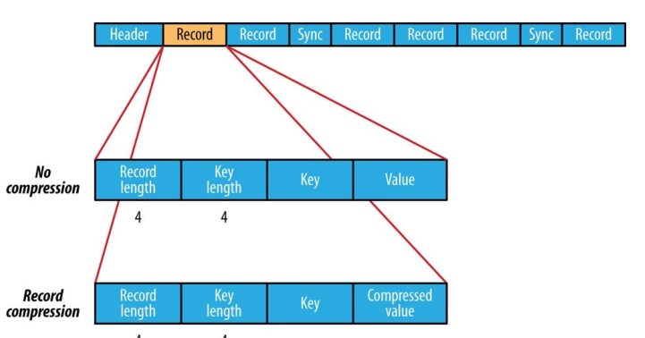
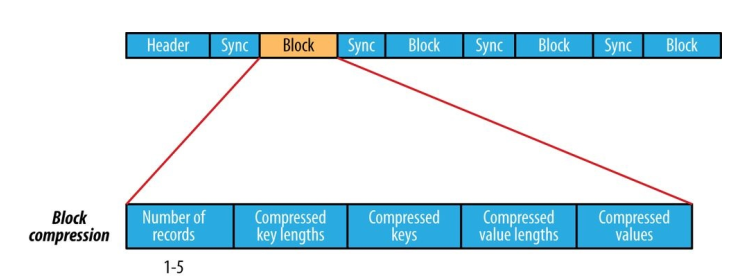

## Sequence file

Provides a persistent data structure for binary key-value pairs.


works well as containers for smaller files.


A sequence file consists of a header followed by one or more records

The first three bytes of a sequence file are the bytes SEQ; 
these are followed by a single byte representing the version number.

The header contains other fields, including:
- the names of the key and value classes,
- compression details,
- user-defined metadata
- the sync marker.

Recall that the sync marker is used to allow a reader to synchronize to a record boundary from any position in the file. 
Each file has a randomly generated sync marker, whose value is stored in the header. 
Sync markers appear between records in the sequence file. 
They are designed to incur less than a 1% storage overhead, so they don’t necessarily appear between every pair of records (such is the case for short records).



The internal format of the records depends on whether compression is enabled, and if it is,
whether it is record compression or block compression.

If no compression is enabled (the default), each record is made up of the record length (in bytes), the key length, the key, and then the value. 
The length fields are written as 4-byte integers adhering to the contract of the writeInt() method of java.io.DataOutput . 
Keys and values are serialized using the Serialization defined for the class being written to the sequence file

The format for record compression is almost identical to that for no compression, except the value bytes are compressed using the codec defined in the header. 
Keys are not compressed.

Block compression compresses multiple records at once; it is therefore more compact than and should generally be preferred over record compression because it has the opportunity to take advantage of similarities between records. 
Records are added to a block until it reaches a minimum size in bytes, defined by the io.seqfile.compress.blocksize property; the default is one million bytes. 
A sync marker is written before the start of every block. 
The format of a block is a field indicating the number of records in the block, followed by four compressed fields: the key lengths, the keys, the value lengths, and the values



3 formats of a Sequence file:
- No Compression (data stored in order of record length, key length, value length, key and value, sync marker - each 100 bytes)
- Record Compression (record compressed while adding to the file, stored in order of record length, key length, key and compressed value, compressed codec is stored in header )
- Block Compression (compressed when data is reaching the block size, sync marks are placed at the beginning and end of each block, min block size is specified using attribute - Block Compression (compressed when data is reaching the block size, sync marks are placed at the beginning and end of each block, min block size is specified using attribute - Block Compression (compressed when data is reaching the block size, sync marks are placed at the beginning and end of each block, min block size is specified using attribute seqfile.compress.blocksizeset)

Block compression is preferrible because it provides more compact data storage.
Block of a sequence file isn't related to HDFS or FS block 


### Map files
Sequence files with index and sorting

Index is stored as a separate file which holds indexes of each of 128 records.
Because files with the data are in key-defined order, records of map file should be ordered, otherwise IOException is thrown.

Map files types: 
- Set file - storing key sequence of Writable in specific order
- Array file - storing key - integer of Writable defining the position in an array
- BloomMapFile - optimized for method get() with dynamic filters usage, storing in memory


### PROC AND CONS
Sequence file PROC:
- more compact comparing to text files
- 2 types of compression
- task parallelization using independent unpacking and different portions of one file;
- can be used as a container for many small files

      
Sequence file CONS: 
- Java API only
- not human readable
 
 
### Usage scenarios:
1) Huge amount of small files issue solving (in Hadoop cluster links to plethora of small files increases memory usage) 
2) Processing of images and text documents, where key or value is a large object, each document is considered as a separate record
3) In MR tasks as I/O format - inner temporal output data of map() function is stored as a sequence file
 
### Writing a sequence file
```java
public static void main(String[] args) throws IOException {
    String uri = args[0];
    Configuration conf = new Configuration();
    FileSystem fs = FileSystem.get(URI.create(uri), conf);
    Path path = new Path(uri);IntWritable key = new IntWritable();
    Text value = new Text();
    SequenceFile.Writer writer = null;
    try {
        writer = SequenceFile.createWriter(fs, conf, path, key.getClass(), value.getClass());
        for (int i = 0; i < 100; i++) {
            key.set(100 - i);
            value.set(DATA[i % DATA.length]);
            System.out.printf("[%s]\t%s\t%s\n", writer.getLength(), key, value);
            writer.append(key, value);
        }
    } finally {
        IOUtils.closeStream(writer);
    }
}
```


### Reading a SequenceFile
```java
Configuration conf = new Configuration();
FileSystem fs = FileSystem.get(URI.create(uri), conf);
Path path = new Path(uri);
SequenceFile.Reader reader = null;
try {
    reader = new SequenceFile.Reader(fs, path, conf);
    Writable key = (Writable)
    ReflectionUtils.newInstance(reader.getKeyClass(), conf);
    Writable value = (Writable)
    ReflectionUtils.newInstance(reader.getValueClass(), conf);
    long position = reader.getPosition();
    while (reader.next(key, value)) {
        String syncSeen = reader.syncSeen() ? "*" : "";
        System.out.printf("[%s%s]\t%s\t%s\n", position, syncSeen, key, value);
        position = reader.getPosition(); // beginning of next record
    }
} finally {
    IOUtils.closeStream(reader);
}
```
