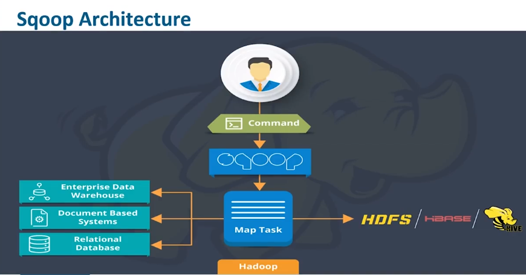
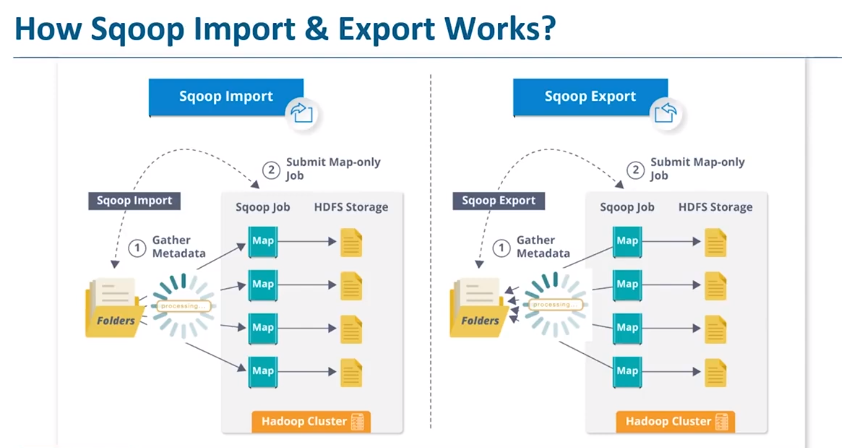

## **Sqoop**
Sqoop = **SQ**_l + had_**OOP**

Tool used to transfer bulk data between HDFS and RDBMS

Allows easy import and export of data from the structured data stores: 
- RDBMS
- Enterprise Data Warehouse
- NoSQL databases

Easy intergation with:
- Hive
- HBase
- Oozie

Highlights:

1. Uses datastore metadata to infer structure definition
2. Uses MR framework to transfer data in parallel
3. Allow structure definitions to be provisioned in Hive metastore
4. Provides an extension mechanism to incorporate high performance connectors for external systems
 

Provides CLI for import/export the data
Internally converts commands into MR tasks which are executed over HDFD
Uses YARN allowing fault-tolerance and parallelism


Project under Apache foundation

#### Features: 
1) FullLoad
2) Incremental load
3) Parallel import/export
4) Compression
5) Kerberos Security integration
6) load data directly to Hive or HBASE


#### Sqoop connectors:
 - ships with connectors for popular databases (MySQL,PostgreSQL,Oracle,SQL Server, DB2, Netezza)
 - supports generic JDBC connector for any database compatible with Java’s JDBC protocol
 - various third-party connectors are available for data stores, that must be downloaded separately and can be added
  to an existing Sqoop installation by following the instructions that come with the connector.







#### **Import order:** 
- Before the import, Sqoop uses JDBC to examine the table to import. 
- retrieves a list of all the columns and their SQL data types.
- maps these SQL types (VARCHAR,INTEGER, etc.) to Java data types (String, Integer, etc.)
- Java data types will hold the field values in MapReduce applications. 
- Sqoop’s code generator uses this information to create a table-specific class to hold a record extracted from the table.
- Generated class will contain getters to retrieve each column from an extracted record
- also it will contain the next serialization methods that form the DBWritable interface, 
which allow the class to interact with JDBC: 
```
public void readFields(ResultSet __dbResults) throws SQLException;
public void write(PreparedStatement __dbStmt) throws SQLException;
```
- The MapReduce job launched by Sqoop uses an InputFormat that can read sections of a table from a database via JDBC.
- The DataDrivenDBInputFormat provided with Hadoop partitions a query’s results over several map tasks
- Better import performance can be gained by dividing this query across multiple nodes using a splitting column 
(Sqoop will guess a good column to use for splitting the table (typically the primary key for the table,
if one exists). The minimum and maximum values for the primary key column are retrieved, 
and then these are used in conjunction with a target number of tasks to determine the queries 
that each map task should issue)
-  particular splitting column can be specified for import job (via the --split-by argument) to tune the job to the data’s actual distribution. 
- If an import job is run as a single (sequential) task with -m 1 , this split process is not performed.
- After generating the deserialization code and configuring the InputFormat, Sqoop sends the job to the MapReduce cluster.
- Map tasks execute the queries 
- Map tasks deserialize rows from the ResultSet into instances of the generated class
- The data are either stored directly in SequenceFile s or transformed into delimited text before being written to HDFS.


User-supplied WHERE clauses are applied before task splitting is performed
They are pushed down into the queries executed by each task.
For more control(to perform column transformations) users can specify a --query argument.


When importing data to HDFS, it is important to ensure access to a consistent snapshot of the source data. 
(Map tasks reading from a database in parallel are running in separate processes. 
Thus, they cannot share a single database transaction.) 
The best way to do this is to ensure that any processes that update existing rows of a table are disabled during the import.

**Incremental Imports**

It’s common to run imports on a periodic basis so that the data in HDFS is kept synchronized with the data stored in the database

Sqoop will import rows that have a column value (for the column specified with --check-column ) that is greater than some specified value (set via --last-value ).

**Modes:** 

The value specified as --last-value can be a row ID that is strictly increasing, this mode is called append mode, and is activated via --incremental append
Time-based incremental imports (specified by --incremental lastmodified ), which is appropriate when existing rows may be updated, and there is a column (the check column) that records
the last modified time of the update.

At the end of an incremental import, Sqoop will print out the value to be specified as --
last-value on the next import.


**Direct-Mode Imports**
Most databases will use the DataDrivenDBInputFormat -based
Some databases, however, offer specific tools designed to extract data quickly. 
For example, MySQL’s mysqldump application can read from a table with greater throughput than a JDBC channel.
The use of these external tools is referred to as direct mode in Sqoop’s documentation.
Direct mode must be specifically enabled by the user (via the --direct argument), as it is not as general purpose as the JDBC approach.
Even when direct mode is used to access the contents of a database, the metadata is still queried through JDBC.

## Large objects 
Sqoop will store imported large objects in a separate file called a LobFil , if they are larger than a threshold size of 16 MB 
(configurable via the _sqoop.inline.lob.length.max_ setting, in bytes).
The LobFile format can store individual records of very large size (a 64-bit address space is used). 
Each record in a LobFile holds a single large object. 
The LobFile format allows clients to hold a reference to a record without accessing the record contents. 
When records are accessed, this is done through a java.io.InputStream (for binary objects) or java.io.Reader (for character-based objects).
When a record is imported, the “normal” fields will be materialized together in a text file, along with a reference to the LobFile where a CLOB or BLOB column is stored.
```
2,gizmo,4.00,2009-11-30,4,null,externalLob(lf,lobfile0,100,5011714)
```
The externalLob(...) text is a reference to an externally stored large object, stored in LobFile format ( lf ) in a file named lobfile0, with the specified byte offset and length inside that file.

When working with this record, 'getSchematic' method would return an object of type BlobRef 
referencing the schematic column, but not actually containing its contents. 

The BlobRef.getDataStream() method actually opens the LobFile and returns an InputStream, 
allowing you to access the schematic field’s contents.

When running a MapReduce job processing many records, you might need to access the schematic fields of only a handful of records. 

This system allows you to incur the I/O costs of accessing only the required large object entries — a big savings,
as individual schematics may be several megabytes or more of data


##Export 
Before exporting a table from HDFS to a database, we must prepare the database to receive the data by creating the target table.
Consequently, you must determine which types are most appropriate.

The JDBC-based export strategy builds up batch INSERT statements 
that will each add multiple records to the target table.

The performance of the export can be affected by the number of parallel writers to the database, 
so Sqoop uses the CombineFileInputFormat class to group the input files into a smaller number of map tasks.

Often an export is not an atomic operation. 
Sqoop will spawn multiple tasks to export slices of the data in parallel. 
These tasks can complete at different times, meaning that even though transactions are used inside tasks, 
results from one task may be visible before the results of another task. 
Moreover, databases often use fixed-size buffers to store transactions. 
As a result, one transaction cannot necessarily contain the entire set of operations performed by a task.
Sqoop commits results every few thousand rows, to ensure that it does not run out of memory.

Sqoop can export to a temporary staging table and then, at the end of the job — if the export has succeeded — 
move the staged data into the destination table in a single transaction. 
You can specify a staging table with the --staging-table option.
The staging table must already exist and have the same schema as the destination. It mustalso be empty, unless the --clear-staging-table option is also supplied.


Sqoop can export records stored in SequenceFiles to an output table too, although some restrictions apply. A SequenceFile cannot contain arbitrary record types. 

Sqoop’s export tool will read objects from SequenceFiles and send them directly to the OutputCollector, 
which passes the objects to the database export OutputFormat. 
To work with Sqoop, the record must be stored in the “value” portion of the SequenceFile’s key-value pair format and 
must subclass the org.apache.sqoop.lib.SqoopRecord abstract class (as is done by all classes generated by Sqoop).


### Formats
By default, Sqoop will generate _comma-delimited text_ files for our imported data.
Delimiters can be specified explicitly, as well as field enclosing and escape characters, to allow the presence of delimiters in the field contents.

Sqoop can import into a few different file formats: 
1. Text files (the default)
2. SequenceFiles (cannot be loaded into Hive, Java specific file format)
3. Avro datafiles (cannot be loaded into Hive)
4. Parquet files.

_Text files:_ 
- offer a human-readable representation of data, 
- platform independence,
- the simplest  structure. 
- cannot hold binary fields (such as database columns of type VARBINARY), 
- cannot distinguish null values and String-based fields containing the value "null" (although using the --null-string import option allows you to control the representation of null values).

_Binary formats allow:_ 
- the most precise representation possible of the imported data
- to compress data while retaining MapReduce’s ability to process different sections of the same file in parallel. 

### Commands 
 Command                   | Description
---------------------------|-----------------------------------------------------------------
 codegen                   | Generate code to interact with database records
 create-hive-table         | Import a table definition into Hive
 eval                      | Evaluate a SQL statement and display the results
 export                    | Export an HDFS directory to a database table
 import                    | Import a table from a database to HDFS
 import-all-tables         | Import tables from a database to HDFS
 job                       | Work with saved jobs
 list-databases            | List available databases on a server
 list-tables               | List available tables in a database
 merge                     | Merge results of incremental imports
 metastore                 | Run a standalone Sqoop metastore
 version                   | Display version information
----------------------------------------------------------------------------------------------

### Commands example: 

**import**  -> imports specified table of RDBMS to Hadoop
``` sh asdadsad
sqoop import 
    --connect jdbc:mysql://host:port/<DB>
    --table <TABLE>
    --username 
    --password
    --m <NUMBER of mappers>
    --where "col_name>10"  //filters records
    --target-dir <DIR where data should be imported>
```
``` Imports all tables to HDFS
sqoop import-all-tables
    --connect jdbc:mysql://host:port/<DB>
    --username 
    --password
    --m <NUMBER of mappers>
    --where "col_name>10"  //filters records
    --target-dir <DIR where data should be imported>
```

**export**  -> exports data from HDFS to RDBMS
``` 
sqoop export 
    --connect jdbc:mysql://host:port/<DB>
    --username 
    --password
    --table <TABLE>
    --m <NUMBER of mappers>
    --where "col_name>10"  //filters records
    --input-fields-terminated-by '\0001' //delimiter for Hive
    --export-dir <DIR where data should be exported from>
```

**list-databases**

``` 
sqoop list-databases
    --connect jdbc:mysql://host:port
    --username 
    --password
```
``` 
sqoop list-tables
    --connect jdbc:mysql://host:port/<DB>
    --username 
    --password
```

**codegen** 
- generates DAO class automatically, 
- Java .class file 
- source code can be recreated
Can be used to regenerate code if the source file was accidentally removed, or generate code with different settings
during the import.
Needed to deserialize data from the SequenceFile storage
``` 
sqoop codegen
    --connect jdbc:mysql://host:port/<DB>
    --username 
    --password
    --table <TABLE>
    --class-name Clazz
```
**create-hive-table** 

Hive’s type system is less rich than that of most SQL systems. Many SQL types do not have direct analogues in Hive.
When Sqoop generates a Hive table definition for an import, it uses the best Hive type available to hold a column’s
values. This may result in a decrease in precision. When this occurs, Sqoop will provide you with a warning message
```sh
sqoop create-hive-table 
    --connect jdbc:mysql://localhost/<DB> 
    --table <TABLE_NAME> 
    --fields-terminated-by ','
```

```sh
sqoop import 
    --connect jdbc:mysql://<HOST>/<DB> 
    --table widgets 
    -m 1 
    --hive-import
```


